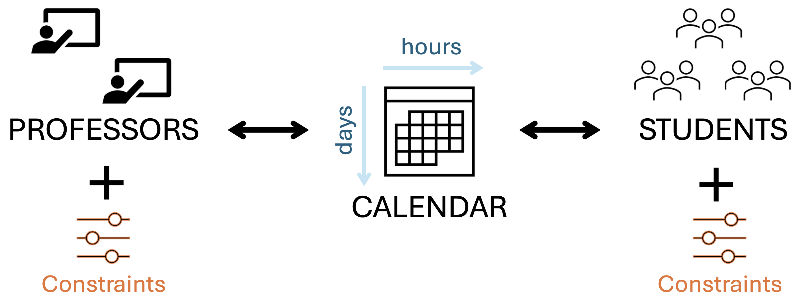
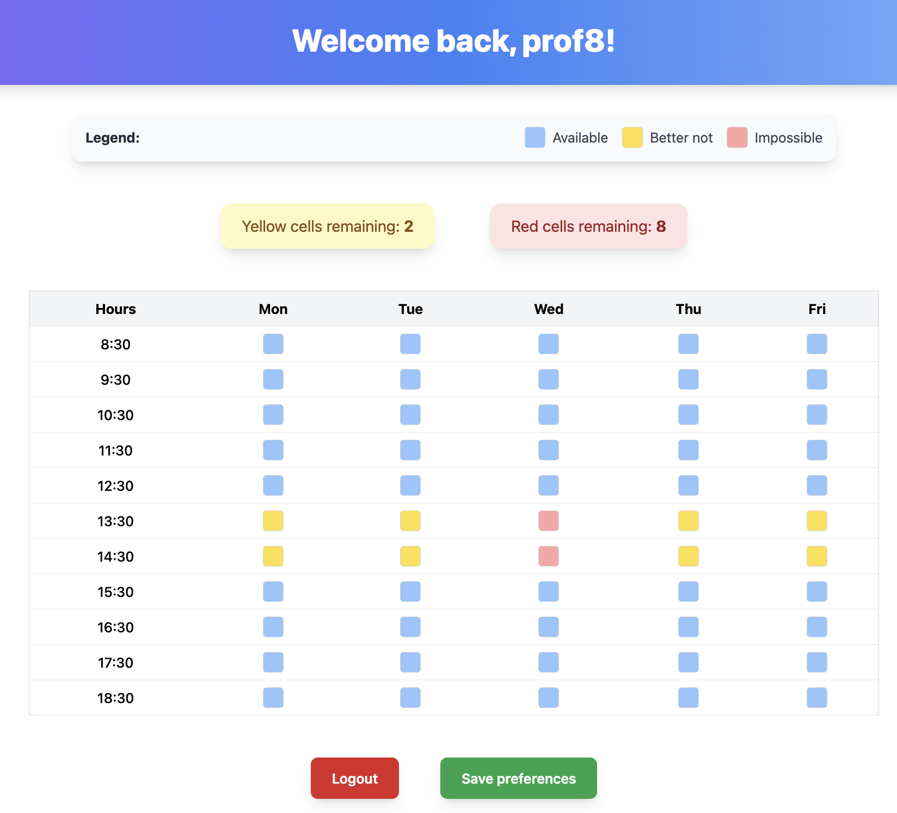
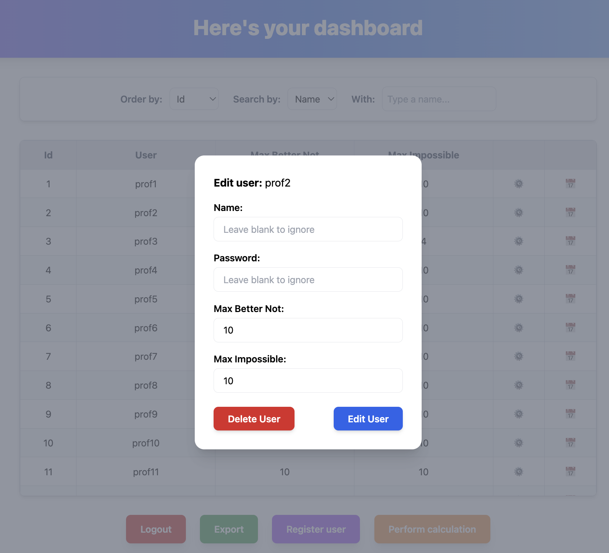
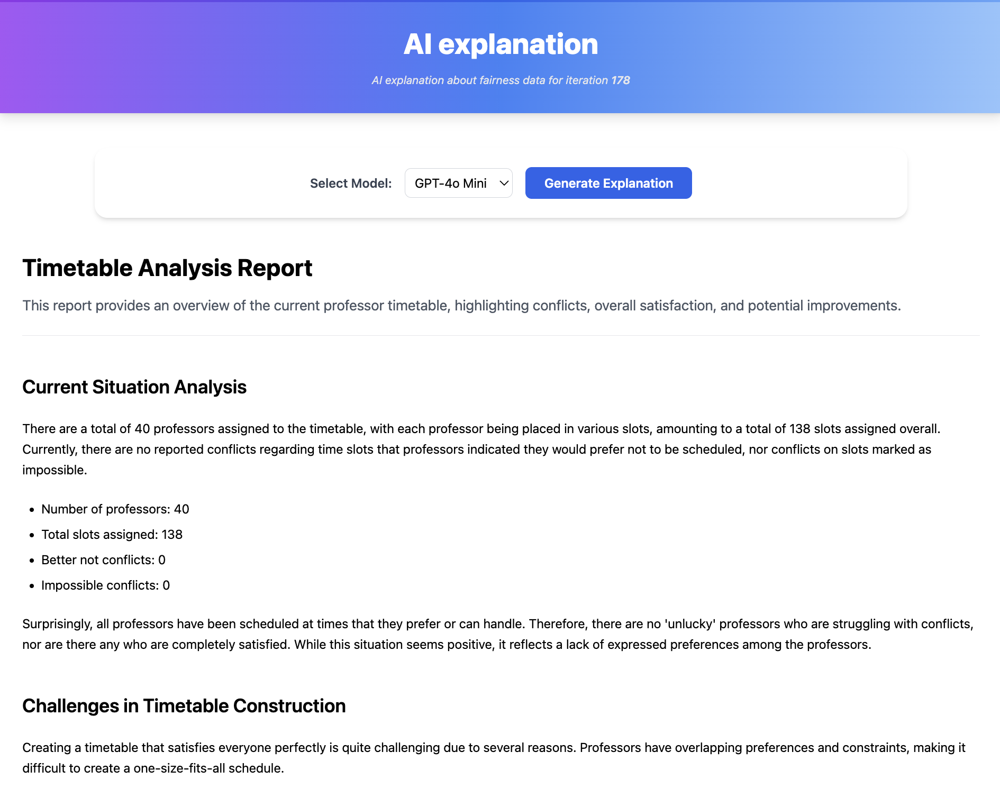

<div align="center">

  <h1>🎯 EFAST: An Explainable Framework for Fair Sequential Tasks Assignment</h1>

  
  
  
  
  
  

</div><br>


**EFaST**, an interactive framework for exploring and understanding fairness in multi-stakeholder sequential task assignment problems.  
This application is created using **Python** (backend) and **TypeScript** (frontend) to manage and run the **FaST** algorithm (Multi-sided Fairness in Sequential Task Assignment) (<a href="https://doi.org/10.1016/j.is.2025.102666">Information System Journal</a>, <a href="https://github.com/4nnina/fair_seq_task_assignment">Github repository</a>).

<br>

A basic user (i.e., a professor) who accesses the software can:
* change their time preferences, deciding which weekly timeslots to mark as *available*, *better not*, or *impossible*.
<br>

The **administrator** who accesses the software can:

* change the information of a basic user (such as name, password, maximum number of *better not* and *impossible* slots that can be used);
* change the time preferences of a basic user as desired;
* download all constraints of all users in CSV format;
* start the FaST-AMOSA algorithm while monitoring its progress during the iterations;
* request AI assistance at any moment during the execution of the algorithm to obtain an overview of the situation, interpret the resulting data, understand why the optimal schedule is (almost) never achievable, and obtain possible ways to improve the schedule as much as possible.
<br>


## 📦 Installation & Setup

#### 1. Clone and go into the repository
   ```bash
   git clone   https://github.com/4nnina/EFaST.git
   cd FAST_thesis
   ```

#### 2. Set up the Python backend environment

  _Creating & joining the backend virtual environment_
   ```bash
   cd backend
   python3 -m venv venv                     
   source venv/bin/activate                 
   ```

   _Installing the libraries_
   ```bash
   pip install --upgrade pip
   pip install -r requirements.txt
   ```

   _Setupping environment variables_

   ```bash
   cp .env.example .env                     
   nano .env                                 # modify env variables with yours
   rm .env.example                           # now It's useless
   ```

  _Quitting the backend virtual environment_

  ```bash
   deactivate
   ```

#### 3. Set up the NodeJs frontend environment

   ```bash
   cd ../frontend
   npm install
   ```

#### 4. Integrate the FAST algorithm into the backend <br>

To complete the setup, you must perform the steps indicated in `backend/FAST/dataset/README.md` and `backend/FAST/src/README.md`. <br><br>


## 🚀 Running the Application

#### 1. Open two different terminal and move both into the main dir

   ```bash
   cd FAST_thesis
   ```

#### 2. Go into the backend dir and start the server (1st terminal)

   ```bash
   cd backend
   ./run.sh
   ```

#### 3. Go into the frontend dir and start the client (2nd terminal)

   ```bash
   cd frontend
   ./run.sh
   ```

#### 4. Open the following link to see the backend server documentation (optional)

   <a href="http://127.0.0.1:5000"> ``` http://127.0.0.1:5000 ``` </a>

#### 5. Open the following link to get to the final application

   ```bash
   http://127.0.0.1:{FRONTEND_PORT}              # FRONTEND_PORT = value from variable in 'frontend/run.sh'
   ```
   Default port is 8000, so then: <a href="http://127.0.0.1:8000"> ``` http://127.0.0.1:8000``` </a><br>

#### 6. Log in as base user or admin

   Currently, these dummy credentials are set in `backend/database/db.sqlite3`.

   | Username | Password |
   |------|-----|
   | admin | pallone |
   | prof1  | ciaone |
   | prof2  | ciaone |
   | ...  | ciaone |
   | prof111  | ciaone |
   | prof112  | ciaone |

<br><br>

## 📷 Case Study

This section illustrates the EFaST framework through a university course scheduling scenario, where tasks (classes) are assigned over a discrete temporal domain (days × hours), and stakeholders (professors, students) submit constraints and preferences on a weekly calendar to drive the optimization.

<figure style="width: 50%;">
   
   <figcaption><em>Schematic representation of the sequential task assignment problem</em></figcaption>
</figure>

<br>

### User Preferences Interface

The professor preferences webpage allows users to express preferences for weekly classes. Time slots marked in **red** indicate strong unavailability, while those in **yellow** indicate weaker preferences to avoid certain slots. Slot values follow the formalization presented in the paper: Available = 0, Better not = −0.5, Impossible = −1.

<figure style="width: 50%;">
   
   <figcaption><em>Professor preferences page showing preferences definition</em></figcaption>
</figure>

<br>

### Administrator Dashboard

The administrator can view and modify professor preferences, add new users, and define limits for the maximum number of 'Better not' and 'Impossible' slots. These limits are essential to maintain feasible timetable assignments and prevent degenerate configurations.

<figure style="width: 50%;">
   
   <figcaption><em>Administrator page for managing user constraints and limits</em></figcaption>
</figure>

<br>

### Monitoring Interface

The administrator initiates the optimization process and monitors local and global fairness indicators throughout the FaST-AMOSA iterations. The interface displays fairness scores and evolution plots that track algorithm progress in real-time.

<figure style="width: 50%;">
  
  <figcaption><em>Real-time monitoring of fairness metrics during optimization</em></figcaption>
</figure>

<br>

### AI-Powered Fairness Explanations

At any iteration step, the administrator can request a natural language explanation by clicking the "Need an explanation" button. The EFaST explanation system allows users to select different LLM models and provides structured insights organized into three parts:

1. **Fairness Analysis**: Qualitatively identifies which constraints remain unsatisfied and which stakeholders are most affected
2. **Structural Conflicts**: Articulates the underlying conflicts and clarifies why certain constraints cannot be jointly satisfied
3. **Improvement Recommendations**: Provides actionable directions for improving fairness, including specific preference adjustments that could reduce imbalance and help administrators explore alternative, potentially fairer configurations

<figure style="width: 50%;">
  
  <figcaption><em>AI-generated fairness explanation with actionable insights</em></figcaption>
</figure>


### Paper reference
Anna Dalla Vecchia, Sara Migliorini, Elisa Quintarelli, and Kostas Stefanidis. EFaST: An Explainable Framework for Fair Sequential Tasks Assignment. 

### Artifact availability & license
- The demonstration paper is distributed under CC BY-NC-ND 4.0 (see PDF footer).
- Code and web demo in this repo: MIT-style (see `LICENSE.txt`).

### Contact & support
For questions about the demo, contact Anna Dalla Vecchia: anna.dallavecchia@univr.it, [@4nnina](https://github.com/4nnina)

